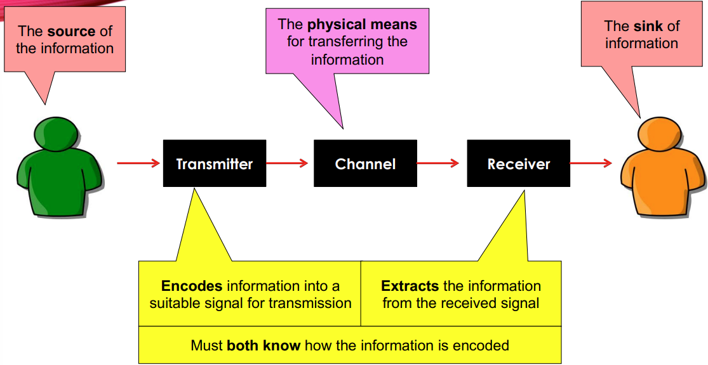
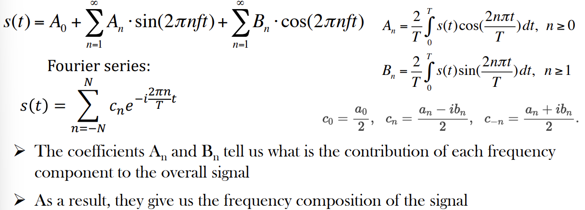
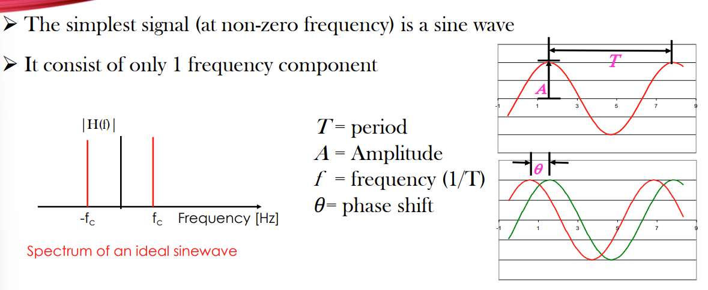

# Telecommunication notes

## What is information?

* **Information** is any entity or form that provides hte answer to a <u>question</u> of some kind or resolves <u>uncertainty.</u>
* Related to data and knowledge.
* Data consists of signal (useful) and noise (useless)
* Information is extracted from data by separating signal from noise

* Information is not "01101" or "words". That is how we express it, information is the concept, value behind the words.
* The amount of infromation in a message can be quantified
* The measure of information is a **bit** - smallest unit allowing you to chose between **2 Equally and probable** alternatives:
  * Yes/no
  * Left/right
> The 2 equally probable meaning for bit is very important.

## Finding a route: Bit by Bits

* Given **n bits of information** you can choose from **m different routes:**
  * ### m = $2^{n}$ 

### Example:

Guess the age of a person  (Imagine a stickman)

* One possible answer is > 40 or < 40
  * This is only 2 choices, and give us little information. And hence the **freedom of choice** is 1 of 2
    * Would need 1 bit to encode this message
* Other possible answer is [0:10] [11:20] ..... [>71]
  * Now there is 8 choices which gives us more information. And hence the **freedom of choice** is 1 of 8
    *  Would need 3 bits to encode the message 
> Remeber the relation between route and bit.

## Information and Entropy

* If **Entropy** is the measure of the uncertainty assoicated with a random variable.
* Information is the measure of a reduction of the **entropy** of a random variable.

Which means that information is a measure of one's **freedom of choice** in selecting a message.

The greater this freedom of choice, the greater of information, the greater is the uncertainty that the message actually selected is some particular one.

> Freedom of choice is essentially the number of choices presented.

## A Communication System and its process

So what does Telecommunication require?

* Message Composition
* Message Encoding
* Transmission of the encooded message using a medium
* Reception of signals and reassembly of the encoded message
* Decoding of the reassembled encoded message
* Interpretation of the presumed original message

## Telecommunication Channel

Use electrical signal or electromagnetic wave for data transmission

Can be classified as:
* Bounded or guided transmission
  * Copper wire (electrical)
  * Coaxial calbe (electromagnetic)
  * Optical fibre (optical)
    * Less susceptible to loss
    * Hard to setup
* Unbouded or unguided transmission
  * Radio and microwaves (electromagnetic)
  * Optical (visual displays, LiFI)
    * More susceptible to loss
    * Easy to setup
  
## Signals: Time and Frequency Domain.

* The faster the signal changes, the higher the frequency of a signal
* The more complicated the shape, the higher the number of frequency components

## Fourier Coefficients

Any periodic signal can be generated by summing up sine waves with different amplitudes, frequncies and phases

## Time and Frequency Domain

## Square wave

We use odd harmonics because think about it this way, our goal is to use sine waves to create square waves. So, In terms of fourier, when the function is odd, we only have the sine terms as the cosine terms go to zero. And hence we choose odd values.

> Odd if f(-t) = - f(t), Even if f(-t) = f(t)

We are also diving by the harmonic value (the number) to reduce the amplitude and match the square wave.

There will be some overshoot at the beginning and the end due do gibbs phenomenon.

To achieve a vertical line, you will need infinite number of harmonics.

Such Transitions (0's rise time) can be real-ised and is only approximated.

## Spectrum

* The spectrum of a signal shows the **amplitude** and **phase** of all the frequency components making up the signal.

## Aperiodic signals

* Aperiodic signal can be considered a periodic signal with T goes to infinity.
* We use fourier transfrom to find the frequency components of an aperiodic signal

> f = 1/T

* The frequency components of the **periodic** signal are separated by the fundamental frequcny (1/T) i.e its spectrum is **discrete.**
* For **aperiodic** signals, the T is infinite, so the spectrum is continuous.

## Relationship between time and frequency

* f = 1/T
* Signals limited in time domain are infinite in frequency domain and vice versa.

## Energy and power signals

* Periodic waveforms exist for infinite time
* Their energy keeps building up, thus theoretically, such signals have infinite energy
* Thus, we call them power waveforms and quote their power [W](power = energy over time e.g. signal period)
* Other signals exist only for a limited time
* Such signals have 0 power (finite energy divided by infinite time)
* Such waveforms are defined as energy signal
* In digital communication systems we produce a pulse to represent data
  * e.g. 1 pulse = 1 bit
* Such pulse is of finite duration and can only be defined through its energy
* A system that sends out a continues stream of pulses may be to be a power signal
* Each waveform/pulse is energy-defined, but the combination of all the pulses corresponds to a power or at least an average power level.
